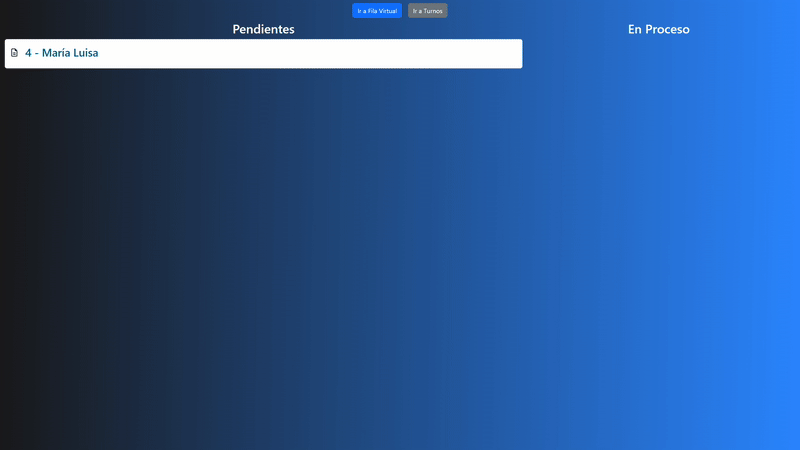

# FilaVirtual

Proyecto simple pero que utiliza hartas tecnologías para lograr una fila virtual en tiempo real con un CRUD de turnos. El proyecto tiene dos páginas pricipales, una del listado de turnos donde puedes crear, modificar y borrar turnos, la otra página es la visualización en tiempo real de los turnos.

## Comenzando 🚀

Usa `npm i` para instalar los paquetes necesarios.

Corre `ng serve` para levantar un servidor dev. Navega a `http://localhost:4200/` para entrar al menú.

Ve a `http://github.com/benjapob/fila-virtual-back` y sigue las instrucciones para correr el backend.

## Overview

Una vez dentro del sistema puedes crear turnos en el menú `Ver Turnos` y agregar, modificar y borrar turnos.

En la pantalla `Ver Fila` puedes ver en tiempo real cómo se mueven los turnos, abajo dejo un ejemplo:

## Construido con 🛠️

* [Angular](https://angular.dev/overview) - El framework web usado

* [Bootstrap](https://getbootstrap.com/docs/5.3/getting-started/introduction/) - Para los estilos

* [Socket](https://github.com/rodgc/ngx-socket-io) - Para manejar las actualizaciones en tiempo real

---
⌨️ por [benjapob](https://github.com/benjapob)